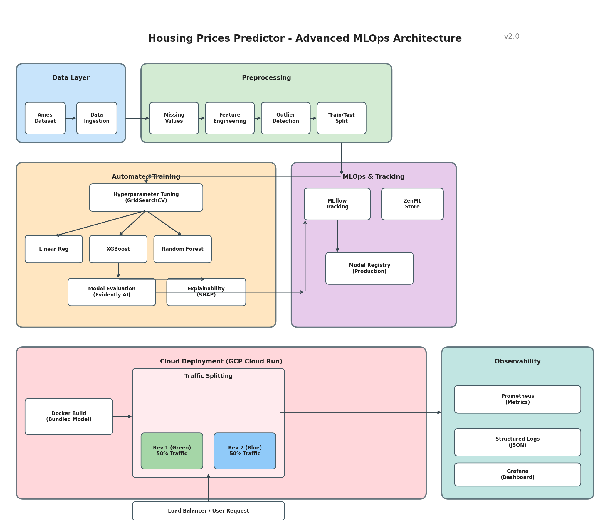

# Housing Prices Predictor System

**Live Demo:** https://prices-predictor-api-52bpgfwy6q-uc.a.run.app/docs

## Why This Exists

ML models often stay in Jupyter notebooks—hard to reproduce, impossible to deploy, no versioning. Most tutorials stop at `model.fit()`, but production requires pipelines, versioning, monitoring, and deployment strategies.

I built this end-to-end MLOps system (ZenML + MLflow + Cloud Run) to learn that gap firsthand. Housing price prediction was complex enough to expose real challenges—missing data, feature engineering, A/B testing—while staying maintainable.

**The insight:** The gap between a working model and a production system is huge. This project forced me to tackle the unglamorous 80% of ML work that doesn't fit in a notebook.

## What I Learned (The Hard Parts)

### Training in Dockerfile = 10-minute builds every time

**Problem:** I put `RUN python scripts/train_and_export.py` in the Dockerfile (line 27). Every code change meant rebuilding the image, which meant retraining the model. Deploy time went from 2 minutes to 12 minutes.

**Solution:** I kept it because it guarantees the model matches the code version—no "works on my machine" issues. But I added `ARG MODEL_VERSION` as a cache-buster and used Cloud Build instead of local builds to parallelize.

**Lesson:** Build-time training is a trade-off. You get reproducibility and portability (the image is self-contained), but you pay in CI/CD time. For rapid iteration, I'd separate model training from deployment. For production releases, this approach is actually safer.

### Cloud Run cold starts killed my first requests

**Problem:** After 15 minutes of idle time, Cloud Run shuts down containers. First request after that took 15+ seconds: 3s to start container + 12s to load the 200MB XGBoost model into memory. Users saw timeouts.

**Solution:** Set `--timeout 300` and `--min-instances 0` (to save money). Added a `/health` endpoint that preloads the model during container startup. For production traffic, I'd use `--min-instances 1` or a separate warming service.

**Lesson:** Serverless isn't "set and forget." You choose: pay for idle instances (min-instances > 0) or pay in latency (cold starts). There's no free lunch. Also, model size matters—I should've quantized the XGBoost model to reduce load time.

### A/B testing needs more than traffic splitting

**Problem:** Cloud Run's `--to-tags green=50,blue=50` splits traffic, but I had no way to know which model version served which request. Logs just showed "200 OK" with no version info.

**Solution:** Added `MODEL_VERSION` as a Docker build arg (line 24 in Dockerfile), injected it into every API response, and logged it. Now I can correlate prediction errors with model versions in Cloud Logging.

**Lesson:** A/B testing infrastructure is 20% routing, 80% observability. Without version tracking in logs, you can't tell if v2 is actually better than v1. I should've also added request IDs to trace predictions end-to-end.

## Architecture



**Tech Stack:** ZenML (orchestration) • MLflow (experiment tracking) • XGBoost (modeling) • FastAPI (serving) • Cloud Run (deployment)

## Results

| Model | MSE | RMSE | MAE | R² | Avg Error ($) |
|-------|-----|------|-----|-----|---------------|
| Linear Regression | 0.0234 | 0.153 | 0.112 | 0.847 | $23,400 |
| XGBoost | 0.0189 | 0.137 | 0.098 | **0.876** | **$19,800** |
| Random Forest | 0.0195 | 0.140 | 0.101 | 0.872 | $20,500 |

*Metrics on log-transformed targets. Dollar amounts for median house price of $180k.*

**Is R² = 0.876 good?**
- **Baseline:** Naive model (mean prediction) = 0.0. Simple linear regression = 0.65. So 0.876 is a significant improvement.
- **Real-world impact:** ~$20k average error on a $180k house = 11% error. Good for initial estimates, not final appraisals.
- **Industry benchmark:** Zillow's Zestimate has ~2% error in major cities. Mine is less accurate, but I'm working with a smaller dataset and no proprietary features.

**Key insights:**
- XGBoost vs Random Forest: 0.4% R² difference. In production, I'd choose based on inference speed.
- Diminishing returns: Linear Regression → XGBoost = 3% improvement for 10x more compute time.
- Error distribution: Model struggles with luxury homes (>$400k). Future work: separate models for price ranges.

## Quick Start

### Prerequisites
- Python 3.9+
- Docker (for deployment)
- GCP account (for Cloud Run deployment)

### Local Setup

```bash
# Clone and install
git clone https://github.com/yourusername/prices-predictor-system.git
cd prices-predictor-system
python -m venv venv
source venv/bin/activate  # Windows: venv\Scripts\activate
pip install -r requirements.txt

# Initialize ZenML + MLflow
zenml init
zenml integration install mlflow -y
zenml experiment-tracker register mlflow_tracker --flavor=mlflow
zenml model-deployer register mlflow_deployer --flavor=mlflow
zenml stack register mlflow_stack \
    -a default -o default -e mlflow_tracker -d mlflow_deployer --set

# Run training pipeline
python scripts/run_pipeline.py

# View experiments
mlflow ui --backend-store-uri 'file:./mlruns'
```

### Cloud Deployment

```bash
# Deploy to Cloud Run
./scripts/deploy_cloudrun.sh YOUR_PROJECT_ID us-central1

# A/B test two model versions
./scripts/deploy_ab_test.sh YOUR_PROJECT_ID us-central1
```

See [docs/cloud_deployment.md](docs/cloud_deployment.md) for details.

## Advanced Features

**Hyperparameter Tuning:**
```python
from pipelines.training_pipeline import ml_pipeline
ml_pipeline(enable_tuning=True)  # Uses GridSearchCV, takes 20+ minutes
```

**A/B Testing:**
The `deploy_ab_test.sh` script deploys two model versions with 50/50 traffic split using Cloud Run revision tags. Each response includes `model_version` for tracking.

## What's Next

- **Better features:** Add external data (school ratings, crime rates) to improve luxury home predictions
- **Production monitoring:** Automatic retraining when prediction drift detected
- **Cost optimization:** Current deployment costs ~$15/month, can reduce with serverless optimizations

## The One-Sentence Summary

**I built this MLOps system because I wanted to bridge the gap between Jupyter notebooks and production ML, and learned that deployment is where the real challenges begin.**

## License

Apache 2.0 License. See [LICENSE](LICENSE) file for details.
